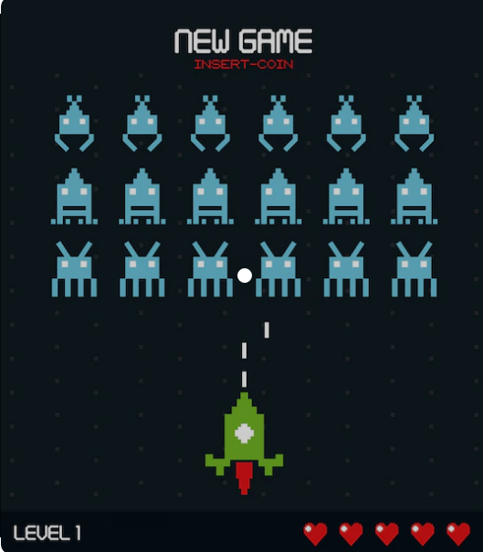

# **NextGame - Database creation**
Utility to create personal account Steam metadata table.

## What do you need:

### Install miniconda (available for Windows and Linux):

https://docs.conda.io/en/latest/miniconda.html

### Create conda environment with R:

> conda create -n r_env r-essentials r-base

### Usage:

1. Open NextGame.R file and modifify line 16 with your own Steam game link
    > system("wget https://steamcommunity.com/id/marko_pakete/games/?tab=all")
2. Load conda environment. 
    > conda activate r_env
3. Run script
    > Rscript NextGame.R 

